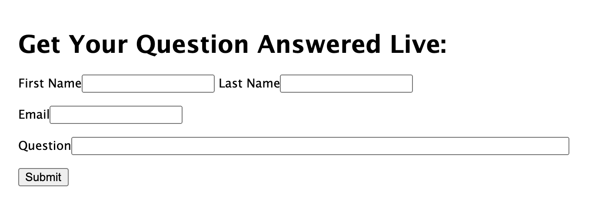

# Summary
This project is a proof of concept to show you how to programmatically use a recording created from a Kaltura Meeting. The meeting can be run in an ad-hoc, on the fly manner and a recording of the meeting will be available for playback.

# Live Demo:

https://kaltura-playback-meeting.herokuapp.com/

# Video Walkthrough:

http://www.kaltura.com/tiny/w97qa

# Prerequisites

1. [Nodejs](https://nodejs.org/en/) 
2. [Kaltura VPaaS account](https://corp.kaltura.com/video-paas/registration?utm_campaign=Meetabout&utm_medium=affiliates&utm_source=GitHub). Once you've opened an account, send an email to <VPaaS@kaltura.com> to activate Meetings.

# How to Run
1. Copy env.template to .env and fill in your information
2. run npm install
3. npm run dev for developement
4. npm start for production

# Documentation

This project consists of two components: 

1. Starting a Kaltura meeting and recording it
2. Finding the recording and playing it back

To start a meeting, the code from [kaltura-nodejs-template](https://github.com/kaltura-vpaas/kaltura-nodejs-template)  was copied into this project, and you can refer to [Kaltura Meetings Integration Guide](https://github.com/kaltura-vpaas/virtual-meeting-rooms ) for a comprehensive guide to the Meetings API. 

First a form is created to gather all necessary information to start a live meeting. The example use-case would be a student that wants to ask a question to a teacher, so a field for question is provided



This form is handled by [index.js](https://github.com/kaltura-vpaas/kaltura-record-playback-meeting/blob/main/routes/index.js#L26) where the Kaltura Meeting is prepared. If you start a Kaltura meeting with your API account and use its record feature, the recording will automatically be ingested into your account's [KMC](https://kmc.kaltura.com/index.php/kmcng/login)

The challenge, is how does this application associate the question being asked with the correct recording?

In [index.js](https://github.com/kaltura-vpaas/kaltura-record-playback-meeting/blob/main/routes/index.js#L26) this is accomplished by creating a unique identifier UUID for this question that can be later used to retrieve its saved video:  

```javascript
  var adhocUUID = uuidv4();
  //uuid will be stripped of - in Kaltura system. Strip now
  //so the correct string can be searched for.
  adhocUUID = adhocUUID.replaceAll("-", "");
  res.cookie('adhoc_uuid', adhocUUID);
```

The UUID is stored in a cookie and works for this simple proof of concept, however this method of persistence is not advised for any production application.

Next, the UUID is inserted into the name of the room which is what the Kaltura API uses as part of the title of the recorded meeting:

```javascript
let room = await createRoom(adminKs, req.body.question + " " + adhocUUID);
```

The room is created in [createRoom.js](https://github.com/kaltura-vpaas/kaltura-record-playback-meeting/blob/main/lib/createRoom.js#L11)

Take note of the `custom_rec_auto_start:1` parameter being used to automatically start recordings when the meeting starts. You can learn about other parameters for Kaltura Meetings at [Kaltura Meetings Integration Guide](https://github.com/kaltura-vpaas/virtual-meeting-rooms )

Finally, two separate links for a meeting room are created:  one link for an admin (Teacher) and another for a student, again in any real-world application these two links would be handled via separate flows as you would not want the student having access to the teacher's room with full controls, but for testing purposes, it is convenient for you to be able to access both links on the same page.

```javascript
  let adminRoom = await joinRoom(null, room.id,
    true,
    "Admin Name",
    "Admin Last Name",
    "admin@admin.admin");

  let studentRoom = await joinRoom(null, room.id,
    false,
    req.body.firstName,
    req.body.lastName,
    req.body.email);
```

These links are created in [joinRoom.js](https://github.com/kaltura-vpaas/kaltura-record-playback-meeting/blob/main/lib/joinRoom.js)

From this point, you will want to open a meeting link and record a meeting. Once you stop the meeting, or the recording, a file will be uploaded to your [KMC](https://kmc.kaltura.com/index.php/kmcng/login) whose name will include the UUID created above. 

It takes a few moments for the recording to be ready, but once it is, it will appear on the first page of the demo at `/` 

The file is found using the [media.list](https://developer.kaltura.com/console/service/media/action/list) API call and its useful `nameLike` search parameter to search for the UUID retrieved from the cookie created in the previous step. 

```javascript
let media = await listMedia(adminKs, req.cookies.adhoc_uuid);
```

Once the media is ready and you refresh the root page of this project, which is handled by [index.js](https://github.com/kaltura-vpaas/kaltura-record-playback-meeting/blob/main/routes/index.js#L18)

```javascript
  if (media.totalCount > 0) {
    ret = { recorded: media.objects[0].id }
  }
  res.render('index', ret);
```

 the entryId of the recording is passed to [`index.ejs`](https://github.com/kaltura-vpaas/kaltura-record-playback-meeting/blob/main/views/index.ejs#L25) via a variable named `recorded` where a Kaltura player is set up to play back the video:

```html
 <h1>Recorded Entries:</h1>
  <%if(locals.recorded){%>
    
    <div id="kaltura-player" style="aspect-ratio: 16/9; max-height: 40vh;"></div>
    <script type="text/javascript">
        var player = KalturaPlayer.setup({
          targetId: "kaltura-player",
          provider: {
            partnerId: <%= process.env.KALTURA_PARTNER_ID %>,
            uiConfId: <%= process.env.KALTURA_PLAYER_ID %>
          }
        });
        //load first entry in player
        player.loadMedia({ entryId: '<%= recorded%>' });
    </script>
    <%}%>
```

# How you can help (guidelines for contributors) 

Thank you for helping Kaltura grow! If you'd like to contribute please follow these steps:
* Use the repository issues tracker to report bugs or feature requests
* Read [Contributing Code to the Kaltura Platform](https://github.com/kaltura/platform-install-packages/blob/master/doc/Contributing-to-the-Kaltura-Platform.md)
* Sign the [Kaltura Contributor License Agreement](https://agentcontribs.kaltura.org/)

# Where to get help
* Join the [Kaltura Community Forums](https://forum.kaltura.org/) to ask questions or start discussions
* Read the [Code of conduct](https://forum.kaltura.org/faq) and be patient and respectful

# Get in touch
You can learn more about Kaltura and start a free trial at: http://corp.kaltura.com    
Contact us via Twitter [@Kaltura](https://twitter.com/Kaltura) or email: community@kaltura.com  
We'd love to hear from you!

# License and Copyright Information
All code in this project is released under the [AGPLv3 license](http://www.gnu.org/licenses/agpl-3.0.html) unless a different license for a particular library is specified in the applicable library path.   

Copyright © Kaltura Inc. All rights reserved.   
Authors and contributors: See [GitHub contributors list](https://github.com/kaltura/YOURREPONAME/graphs/contributors).  

### Open Source Libraries Used
